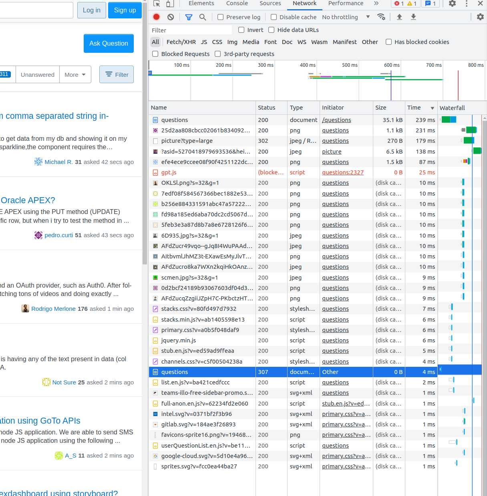

## Домашнее задание к занятию "3.6. Компьютерные сети, лекция 1"

### 1. Работа c HTTP через телнет.

- Подключитесь утилитой телнет к сайту stackoverflow.com `telnet stackoverflow.com 80
`
- отправьте HTTP запрос
    
```
GET /questions HTTP/1.0 
HOST: stackoverflow.com
[press enter]
[press enter]
```
- В ответе укажите полученный HTTP код, что он означает?

```commandline
Trying 151.101.65.69...
Connected to stackoverflow.com.
Escape character is '^]'.
GET /questions HTTP/1.0
HOST: stackoverflow.com

HTTP/1.1 301 Moved Permanently
Server: Varnish
Retry-After: 0
Location: https://stackoverflow.com/questions
Content-Length: 0
Accept-Ranges: bytes
Date: Tue, 23 Aug 2022 18:35:49 GMT
Via: 1.1 varnish
Connection: close
X-Served-By: cache-fra19151-FRA
X-Cache: HIT
X-Cache-Hits: 0
X-Timer: S1661279749.332841,VS0,VE0
Strict-Transport-Security: max-age=300
X-DNS-Prefetch-Control: off

Connection closed by foreign host.
```
#### _301 - страница переехала на новый URL - https://stackoverflow.com/questions_

### 2. Повторите задание 1 в браузере, используя консоль разработчика F12.
- откройте вкладку Network
- отправьте запрос http://stackoverflow.com
- найдите первый ответ HTTP сервера, откройте вкладку Headers
- укажите в ответе полученный HTTP код.

#### _307 Internal Redirect_
- проверьте время загрузки страницы, какой запрос обрабатывался дольше всего?
- приложите скриншот консоли браузера в ответ.



### 3.  Какой IP адрес у вас в интернете?

#### _Динамический - 79.139.177.75. Сижу за NAT_

### 4.  Какому провайдеру принадлежит ваш IP адрес? Какой автономной системе AS? Воспользуйтесь утилитой `whois`

```commandline
$ whois -h whois.radb.net 79.139.177.75
% Information related to '79.139.128.0/17AS25513'

route:          79.139.128.0/17
descr:          Moscow Local Telephone Network (OAO MGTS)
descr:          Moscow, Russia
origin:         AS25513
mnt-by:         MGTS-USPD-MNT
created:        2007-11-01T11:08:49Z
last-modified:  2007-11-01T11:08:49Z
source:         RIPE
```
#### _Провайдер МГТС, AS25513_

### 5.  Через какие сети проходит пакет, отправленный с вашего компьютера на адрес 8.8.8.8? Через какие AS? Воспользуйтесь утилитой `traceroute`

````commandline
$ traceroute -An 8.8.8.8
traceroute to 8.8.8.8 (8.8.8.8), 30 hops max, 60 byte packets
 1  192.168.88.1 [*]  0.800 ms  0.765 ms  0.740 ms
 2  192.168.200.1 [*]  0.713 ms  615.973 ms  615.935 ms
 3  192.168.1.1 [*]  615.887 ms  615.849 ms  615.819 ms
 4  100.81.0.1 [*]  5.322 ms  5.347 ms  5.357 ms
 5  212.188.1.6 [AS8359]  5.519 ms * *
 6  212.188.1.5 [AS8359]  5.628 ms * *
 7  72.14.223.72 [AS15169]  5.100 ms 72.14.223.74 [AS15169]  4.936 ms  4.958 ms
 8  108.170.250.99 [AS15169]  5.000 ms  5.079 ms 108.170.250.66 [AS15169]  6.152 ms
 9  142.250.238.214 [AS15169]  22.693 ms 142.251.49.158 [AS15169]  22.369 ms 142.251.237.156 [AS15169]  20.935 ms
10  142.250.235.68 [AS15169]  22.400 ms 72.14.232.76 [AS15169]  26.782 ms 209.85.254.20 [AS15169]  19.246 ms
11  142.250.56.215 [AS15169]  24.806 ms 172.253.64.51 [AS15169]  24.831 ms 209.85.251.41 [AS15169]  20.924 ms
12  * * *
13  * * *
14  * * *
15  * * *
16  * * *
17  * * *
18  * * *
19  * * *
20  * * *
21  8.8.8.8 [AS15169]  19.790 ms  22.378 ms *
````

### 6.  Повторите задание 5 в утилите mtr. На каком участке наибольшая задержка - delay?

```commandline
$ sudo mtr -zn -i 0.1 -o "LSD NBAW" 8.8.8.8
                                              My traceroute  [v0.95]
uwork-comp (192.168.88.177) -> 8.8.8.8 (8.8.8.8)                                           2022-08-27T15:04:01+0300
Keys:  Help   Display mode   Restart statistics   Order of fields   quit
                                                                            Packets               Pings
 Host                                                                     Loss%   Snt Drop   Last  Best   Avg  Wrst
 1. AS???    192.168.88.1                                                  0.0%  1356    0    0.3   0.1   0.2   0.4
 2. AS???    192.168.1.1                                                   0.0%  1356    0    0.7   0.4   0.5   1.2
 3. AS???    100.81.0.1                                                    0.0%  1356    0    7.5   2.9   4.9  43.8
 4. AS8359   212.188.1.6                                                   3.5%  1355   48    3.5   2.6   3.9  22.0
 5. AS8359   212.188.1.5                                                  36.9%  1355  499    4.2   3.4   5.0  60.9
 6. AS15169  72.14.223.72                                                  0.0%  1355    0    4.5   3.9   5.4 178.0
 7. AS15169  108.170.250.66                                                0.0%  1355    0    5.8   4.7   5.6  12.5
 8. AS15169  142.250.238.214                                               0.0%  1355    0   21.1  20.1  22.2 133.6
 9. AS15169  142.250.233.0                                                 0.0%  1355    0   19.1  18.6  22.3 125.7
10. AS15169  172.253.51.219                                                0.0%  1355    0   20.9  20.4  21.1  86.8
11. (waiting for reply)
12. (waiting for reply)
13. (waiting for reply)
14. (waiting for reply)
15. (waiting for reply)
16. (waiting for reply)
17. (waiting for reply)
18. (waiting for reply)
19. (waiting for reply)
20. AS15169  8.8.8.8                                                       0.0%  1355    0   21.2  20.3  21.1  21.7
```
#### _Максимальная задежка была на участке 6, максимальная средняя на 9_

### 7.  Какие DNS сервера отвечают за доменное имя dns.google? Какие A записи? воспользуйтесь утилитой dig

```commandline
$ dig dns.google

; <<>> DiG 9.18.1-1ubuntu1.1-Ubuntu <<>> dns.google
;; global options: +cmd
;; Got answer:
;; ->>HEADER<<- opcode: QUERY, status: NOERROR, id: 31493
;; flags: qr rd ra; QUERY: 1, ANSWER: 2, AUTHORITY: 13, ADDITIONAL: 3

;; OPT PSEUDOSECTION:
; EDNS: version: 0, flags:; udp: 65494
;; QUESTION SECTION:
;dns.google.                    IN      A

;; ANSWER SECTION:
dns.google.             134     IN      A       8.8.8.8
dns.google.             134     IN      A       8.8.4.4
....
```

### 8.  Проверьте PTR записи для IP адресов из задания 7. Какое доменное имя привязано к IP? воспользуйтесь утилитой dig

```commandline
$ dig -x 8.8.8.8

; <<>> DiG 9.18.1-1ubuntu1.1-Ubuntu <<>> -x 8.8.8.8
;; global options: +cmd
;; Got answer:
;; ->>HEADER<<- opcode: QUERY, status: NOERROR, id: 29887
;; flags: qr rd ra; QUERY: 1, ANSWER: 1, AUTHORITY: 6, ADDITIONAL: 13

;; OPT PSEUDOSECTION:
; EDNS: version: 0, flags:; udp: 65494
;; QUESTION SECTION:
;8.8.8.8.in-addr.arpa.          IN      PTR

;; ANSWER SECTION:
8.8.8.8.in-addr.arpa.   5052    IN      PTR     dns.google.
....
```
```commandline
$ dig -x 8.8.4.4

; <<>> DiG 9.18.1-1ubuntu1.1-Ubuntu <<>> -x 8.8.4.4
;; global options: +cmd
;; Got answer:
;; ->>HEADER<<- opcode: QUERY, status: NOERROR, id: 27786
;; flags: qr rd ra; QUERY: 1, ANSWER: 1, AUTHORITY: 6, ADDITIONAL: 13

;; OPT PSEUDOSECTION:
; EDNS: version: 0, flags:; udp: 65494
;; QUESTION SECTION:
;4.4.8.8.in-addr.arpa.          IN      PTR

;; ANSWER SECTION:
4.4.8.8.in-addr.arpa.   19539   IN      PTR     dns.google.
....
```