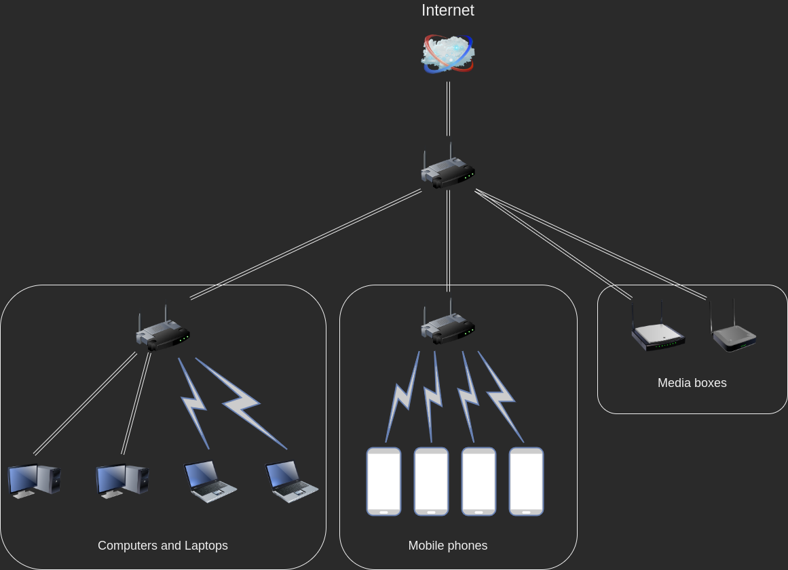

## Домашнее задание к занятию "3.8. Компьютерные сети, лекция 3"

### 1. Подключитесь к публичному маршрутизатору в интернет. Найдите маршрут к вашему публичному IP

```
telnet route-views.routeviews.org
Username: rviews
show ip route x.x.x.x/32
show bgp x.x.x.x/32
```

```commandline
$ telnet route-views.routeviews.org
Trying 128.223.51.103...
Connected to route-views.routeviews.org.

....

User Access Verification

Username: rviews
route-views>show ip route 79.139.177.75
Routing entry for 79.139.128.0/17
  Known via "bgp 6447", distance 20, metric 0
  Tag 2497, type external
  Last update from 202.232.0.2 7w0d ago
  Routing Descriptor Blocks:
  * 202.232.0.2, from 202.232.0.2, 7w0d ago
      Route metric is 0, traffic share count is 1
      AS Hops 3
      Route tag 2497
      MPLS label: none
route-views>show bgp 79.139.177.75/32     
% Network not in table
route-views>show bgp 79.139.177.0/24  
% Network not in table

route-views>show ip route 8.8.8.8   
Routing entry for 8.8.8.0/24
  Known via "bgp 6447", distance 20, metric 0
  Tag 2497, type external
  Last update from 202.232.0.2 7w0d ago
  Routing Descriptor Blocks:
  * 202.232.0.2, from 202.232.0.2, 7w0d ago
      Route metric is 0, traffic share count is 1
      AS Hops 2
      Route tag 2497
      MPLS label: none
route-views>show bgp 8.8.8.8/32
% Network not in table
route-views>show bgp 8.8.8.0/24
BGP routing table entry for 8.8.8.0/24, version 2327039946
Paths: (21 available, best #20, table default)
  Not advertised to any peer
  Refresh Epoch 1
  20130 6939 15169
    140.192.8.16 from 140.192.8.16 (140.192.8.16)
      Origin IGP, localpref 100, valid, external
      path 7FE0E9213CC8 RPKI State valid
      rx pathid: 0, tx pathid: 0
  Refresh Epoch 1
  20912 15169
    212.66.96.126 from 212.66.96.126 (212.66.96.126)
      Origin IGP, localpref 100, valid, external
      Community: 20912:65016
      path 7FE0D1C5F688 RPKI State valid
      rx pathid: 0, tx pathid: 0
  Refresh Epoch 1
  49788 12552 15169
    91.218.184.60 from 91.218.184.60 (91.218.184.60)
      Origin IGP, localpref 100, valid, external
      Community: 12552:10000 12552:14000 12552:14100 12552:14101 12552:24000
      Extended Community: 0x43:100:1
      path 7FE03A7AAD78 RPKI State valid
      rx pathid: 0, tx pathid: 0
  Refresh Epoch 1
  3333 15169
    193.0.0.56 from 193.0.0.56 (193.0.0.56)
      Origin IGP, localpref 100, valid, external
      path 7FE12BE9DA40 RPKI State valid
      rx pathid: 0, tx pathid: 0
  Refresh Epoch 1
  53767 174 174 6453 15169
    162.251.163.2 from 162.251.163.2 (162.251.162.3)
      Origin IGP, localpref 100, valid, external
      Community: 174:21000 174:22013 53767:5000
      path 7FE0C35FC158 RPKI State valid
      rx pathid: 0, tx pathid: 0
  Refresh Epoch 1
  101 15169
    209.124.176.223 from 209.124.176.223 (209.124.176.223)
      Origin IGP, localpref 100, valid, external
      Community: 101:20400 101:22200
      path 7FE09A9B2D20 RPKI State valid
      rx pathid: 0, tx pathid: 0
  Refresh Epoch 1
  3561 209 15169
    206.24.210.80 from 206.24.210.80 (206.24.210.80)
      Origin IGP, localpref 100, valid, external
      path 7FE116FA5760 RPKI State valid
      rx pathid: 0, tx pathid: 0
  Refresh Epoch 1
  8283 15169
    94.142.247.3 from 94.142.247.3 (94.142.247.3)
      Origin IGP, metric 0, localpref 100, valid, external
      Community: 8283:1 8283:101 8283:102
      unknown transitive attribute: flag 0xE0 type 0x20 length 0x24
```


### 2. Создайте dummy0 интерфейс в Ubuntu. Добавьте несколько статических маршрутов. Проверьте таблицу маршрутизации.

```commandline
$ sudo modprobe dummy
$ lsmod | grep dummy
dummy                  16384  0
$ sudo ip link add dummy0 type dummy
$ sudo ip addr add 10.10.2.0/24 dev dummy0
$ sudo ip link set dummy0 up
$ ip a show dev dummy0
6: dummy0: <BROADCAST,NOARP,UP,LOWER_UP> mtu 1500 qdisc noqueue state UNKNOWN group default qlen 1000
    link/ether 66:a5:24:e8:95:b6 brd ff:ff:ff:ff:ff:ff
    inet 10.10.2.0/24 scope global dummy0
       valid_lft forever preferred_lft forever
    inet6 fe80::64a5:24ff:fee8:95b6/64 scope link 
       valid_lft forever preferred_lft forever

$ sudo ip route add 192.168.200.0/24 via 192.168.88.1 dev eno1
$ sudo ip route add 192.168.99.0/24 via 10.10.2.1
$ ip r
default via 192.168.88.1 dev eno1 proto static metric 100 
10.10.2.0/24 dev dummy0 proto kernel scope link src 10.10.2.0 
169.254.0.0/16 dev eno1 scope link metric 1000 
172.16.0.0/24 via 172.26.127.1 dev kvnet proto unspec metric 1 onlink 
172.16.65.0/24 dev vmnet8 proto kernel scope link src 172.16.65.1 
172.16.178.0/24 dev vmnet1 proto kernel scope link src 172.16.178.1 
172.26.127.0/24 dev kvnet proto kernel scope link src 172.26.127.18 
192.168.0.0/24 via 172.26.127.1 dev kvnet proto unspec metric 1 onlink 
192.168.88.0/24 dev eno1 proto kernel scope link src 192.168.88.202 metric 100 
192.168.99.0/24 via 10.10.2.1 dev dummy0 
192.168.200.0/24 via 192.168.88.1 dev eno1 
```

### 3. Проверьте открытые TCP порты в Ubuntu, какие протоколы и приложения используют эти порты? Приведите несколько примеров.

```commandline
$ sudo ss -tlpn4
State        Recv-Q       Send-Q               Local Address:Port                Peer Address:Port       Process                                          
LISTEN       0            4096                       0.0.0.0:57009                    0.0.0.0:*           users:(("rpc.mountd",pid=1560,fd=9))            
LISTEN       0            4096                 127.0.0.53%lo:53                       0.0.0.0:*           users:(("systemd-resolve",pid=685,fd=14))       
LISTEN       0            128                        0.0.0.0:22                       0.0.0.0:*           users:(("sshd",pid=879,fd=3))                   
LISTEN       0            128                      127.0.0.1:631                      0.0.0.0:*           users:(("cupsd",pid=100900,fd=7))               
LISTEN       0            10                         0.0.0.0:7070                     0.0.0.0:*           users:(("anydesk",pid=866,fd=32))               
LISTEN       0            4096                       0.0.0.0:54367                    0.0.0.0:*           users:(("rpc.mountd",pid=1560,fd=13))           
LISTEN       0            4096                       0.0.0.0:41925                    0.0.0.0:*           users:(("rpc.statd",pid=1550,fd=9))             
LISTEN       0            4096                       0.0.0.0:54053                    0.0.0.0:*           users:(("rpc.mountd",pid=1560,fd=5))            
LISTEN       0            3                        127.0.0.1:43434                    0.0.0.0:*           users:(("kvpncsvc",pid=882,fd=16))              
LISTEN       0            4096                       0.0.0.0:111                      0.0.0.0:*           users:(("rpcbind",pid=683,fd=4),("systemd",pid=1,fd=181))
```
Порт 53 (tcp, udp) - DNS, systemd-resolved.service, 22 (tcp) - SSH сервер, ssh.service, 631 (tcp, udp) - служба принтеров CUPS, cups-browsed.service

### 4. Проверьте используемые UDP сокеты в Ubuntu, какие протоколы и приложения используют эти порты?

```commandline
$ sudo ss -ulpn4
State      Recv-Q     Send-Q           Local Address:Port            Peer Address:Port     Process                                                        
UNCONN     0          0                      0.0.0.0:56011                0.0.0.0:*         users:(("rpc.mountd",pid=1560,fd=8))                          
UNCONN     0          0                      0.0.0.0:58626                0.0.0.0:*         users:(("rpc.mountd",pid=1560,fd=12))                         
UNCONN     0          0                    127.0.0.1:43434                0.0.0.0:*         users:(("kvpncsvc",pid=882,fd=17))                            
UNCONN     0          0                      0.0.0.0:43798                0.0.0.0:*         users:(("avahi-daemon",pid=771,fd=14))                        
UNCONN     0          0                    127.0.0.1:45743                0.0.0.0:*         users:(("kvpncsvc",pid=882,fd=14))                            
UNCONN     0          0                    127.0.0.1:48011                0.0.0.0:*         users:(("kvpncsvc",pid=882,fd=13))                            
UNCONN     0          0                127.0.0.53%lo:53                   0.0.0.0:*         users:(("systemd-resolve",pid=685,fd=13))                     
UNCONN     0          0                      0.0.0.0:111                  0.0.0.0:*         users:(("rpcbind",pid=683,fd=5),("systemd",pid=1,fd=182))     
UNCONN     0          0                      0.0.0.0:631                  0.0.0.0:*         users:(("cups-browsed",pid=100902,fd=7))                      
UNCONN     0          0                      0.0.0.0:50001                0.0.0.0:*         users:(("anydesk",pid=866,fd=46))                             
UNCONN     0          0                    127.0.0.1:878                  0.0.0.0:*         users:(("rpc.statd",pid=1550,fd=5))                           
UNCONN     0          0                      0.0.0.0:51107                0.0.0.0:*         users:(("rpc.mountd",pid=1560,fd=4))                          
UNCONN     0          0               192.168.88.202:36458                0.0.0.0:*         users:(("kvpncsvc",pid=882,fd=18))                            
UNCONN     0          0                      0.0.0.0:54317                0.0.0.0:*         users:(("rpc.statd",pid=1550,fd=8))                           
UNCONN     0          0                      0.0.0.0:5353                 0.0.0.0:*         users:(("avahi-daemon",pid=771,fd=12))  
```

### 5. Используя diagrams.net, создайте L3 диаграмму вашей домашней сети или любой другой сети, с которой вы работали.


